# 工业园区智能可视化与 AI 平台 · 项目展示文档

---

## 1. 快速演示路径总览

| 模块/主题 | 页面/入口 | 三步演示法 | 期望看到 | 参考截图 |
|-----------|-----------|------------|----------|----------|
| 主页面与商家推荐侧栏导航 | `/`（主页） | 1) 展开推荐侧栏 2) 筛选/高亮 3) 点击“天气分析”入口 | 侧栏与主视图联动、高亮与跳转 | 图0 |
| 天气分析与路线避险 | 主页 → 商家推荐侧栏 → `/weather` | 1) 开图层 2) 点省份/点位 3) 路线分析 | 风险着色、Tooltip、避险逻辑 | 图1、图2 |
| 语音助手（含全屏/图层控制） | 主应用浮窗 | 1) 开始识别 2) 下达口令 3) 观察联动 | 页面跳转、全屏切换、图层切换 | 图3 |
| 聊天助手（LKE 主、Appflow 备） | 浮窗聊天 / `tests/pages/appflow-test-standalone.html` | 1) 初始化 2) 打开窗口 3) 发送消息 | 流式回复/状态日志/降级兜底 | 图4 |
| 视频识别（MediaPipe 优先） | `/video-recognition` | 1) 选视频 2) 开始推理 3) 观察统计 | 检测框、置信度曲线、参数面板 | 图5 |
| 火灾疏散模拟 | `/fire-evacuation` | 1) 打开页面 2) 选择场景 3) 切换视角/播放控制 | 视频网格、视角切换、加载指示 | 图7 |
| 弱网地图修复验证 | `/weather` + DevTools | 1) 网络限速 2) 刷新 3) 看脚本加载与兜底 | 动态加载成功/无未定义错误 | 图6 |

> 温馨提示：建议演示顺序为 “主页面（推荐侧栏导航）→ 天气 → 语音 → 聊天 → 视频识别 → 火灾疏散 → 弱网地图”。

---

## 2. 操作前准备

- 请在项目根目录创建 `.env.local` 文件，并至少包含以下环境变量：

  ```
  # 和风天气 API 密钥
  VITE_QWEATHER_KEY=YOUR_QWEATHER_KEY_HERE
  
  # 高德地图 API 密钥
  VITE_AMAP_KEY=YOUR_AMAP_KEY_HERE
  VITE_AMAP_SECURITY=YOUR_AMAP_SECURITY_KEY_HERE
  
  # LKE 平台配置 (主链路)
  VITE_LKE_APP_KEY=YOUR_LKE_APP_KEY_HERE
  VITE_LKE_BOT_ID=YOUR_LKE_BOT_ID_HERE
  VITE_LKE_ACCESS_TYPE=ws
  VITE_LKE_TOKEN_ENDPOINT=/getDemoToken
  
  # Appflow Chat (备选链路)
  VITE_APPFLOW_INTEGRATE_ID=YOUR_APPFLOW_INTEGRATE_ID_HERE
  VITE_APPFLOW_REQUEST_DOMAIN=YOUR_APPFLOW_REQUEST_DOMAIN_HERE
  ```

  ### 1.3 启动服务

  1. **安装依赖：**

     ```
     npm install
     ```

  2. **启动前端应用：**

     ```
     npm run dev
     ```

     - 默认访问地址：`http://localhost:5173/`

  3. **启动 Token 演示服务（必需）：**

     ```
     node server/lke-token-server.mjs
     ```

     - 此服务为 LKE 聊天提供动态 Token 签发，必须保持运行。
- 默认地址：http://localhost:5173/
---

## 3. 场景零：主页面与商家推荐侧栏（入口导航）

演示步骤：
1) 打开首页 `/`，展开右侧或左侧的“商家推荐侧栏”。
2) 演示筛选/排序（如：区域、风险、类型），观察主视图卡片/点位联动高亮。
3) 在侧栏卡片或操作区点击“天气分析”入口，进入天气分析页面或触发天气分析抽屉/模块。

预期结果：
- 侧栏与主视图联动（Hover/选中时主视图高亮/定位）。
- 点击“天气分析”后进入天气模块（通常是跳转到 `/weather`）。

截图：
- 图0：主页面 + 商家推荐侧栏
  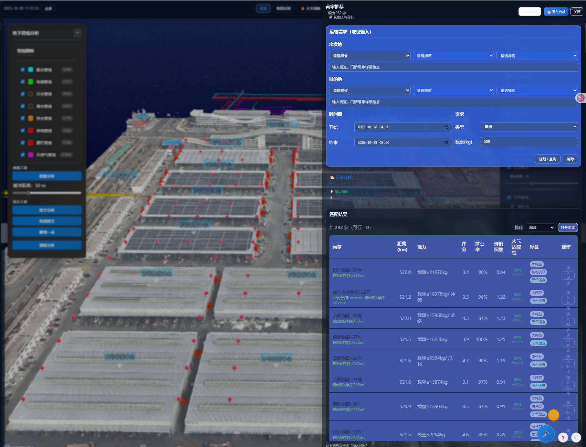

补充说明：
- 如项目为抽屉式天气分析，也可在首页内直接展开模块，无需路由跳转。
- 推荐在演示时简述：为何从业务入口（商家推荐）引入天气分析，以体现“从业务到分析”的自然链路。

### 3.1 主页面功能总览（可逐项演示）

- 图层面板（右上角，可折叠）
  - 基础：OSGB 建筑、厂房模型（支持“厂房掀盖”动画开关）、仓库面(GeoJSON)、楼层抽屉、设施标注、灭火器、全景红点
  - 管线：地下管线（支持“地形透明度”滑块，查看地下剖面）
  - 红点：全景红点聚合（强度可调）
  - 天气：温度/降水/风力/预警 子层与透明度
  - 物流曲线：园区→目的地 曲线（数量上限/分段/高度比例）
  - 性能：Tiles 细节（SSE）

- 管线分析工具（左上角，可折叠）
  - 剖面分析：依次点击两点生成剖面，缓冲距离可调；自动列出附近管线，支持高亮闪烁与导出 CSV/GeoJSON
  - 挖方分析：多边形绘制（单击加点，双击或“完成挖方”结束），支持 Backspace 撤销、Esc 取消、面积/周长标注与附近管线列表
  - 图例：按管线类型分组显隐（同步数据源 show 状态）

- 楼层抽屉：点击楼层模型展开目标楼层并半透明其他楼层，再次点击空白处复位

- 设施/灭火器：提高相对地面高度，带标签/气泡图样式，便于视认

- 全景红点：自定义图标、聚合、距离显示；点击可打开本地全景或外部链接，全景在内置查看器中展示

- 推荐联动：商家在侧栏选中后，首页地图自动飞行定位与高亮，左上悬浮窗展示评分、准时率与标签，支持拖拽移动

- 园区曲线：从选中仓库中心到各目的地绘制抛物线连接（可调细节/高度/数量），便于观察辐射范围

- 快捷键：挖方分析中 Backspace/Delete 撤销一点，Esc 取消本次绘制

操作脚本建议（首页演示顺序）：
1) 展开图层面板，依次切换“全景红点/设施/灭火器/仓库面/楼层抽屉”观察效果（图0-1）
2) 开启“地下管线”，降低“地形透明度”，点击“剖面分析”两点生成剖面并查看列表、导出（图0-2）
3) 切换“挖方分析”，圈选区域并完成，观察面积/周长标注与附近管线（图0-2）
4) 点击楼层模型展开与复位（图0-3）
5) 查看设施/灭火器标注样式（图0-4）
6) 缩放查看全景红点聚合效果，点击打开全景查看器（图0-5）
7) 在推荐侧栏选中商家，观察地图飞行与悬浮窗（图0-6）
8) 打开“园区→目的地曲线”，调整“数量上限/分段/高度”（图0-7）

截图：
- 图0-1：图层面板总览
  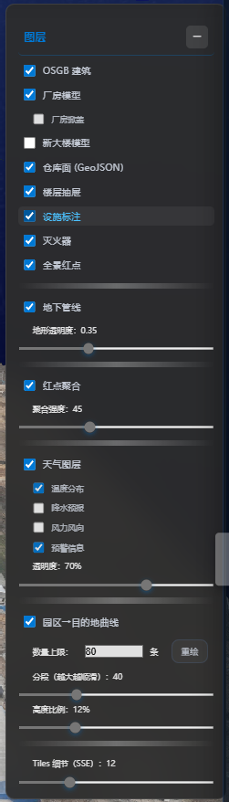
- 图0-2：管线分析（剖面/挖方/图例/导出）
  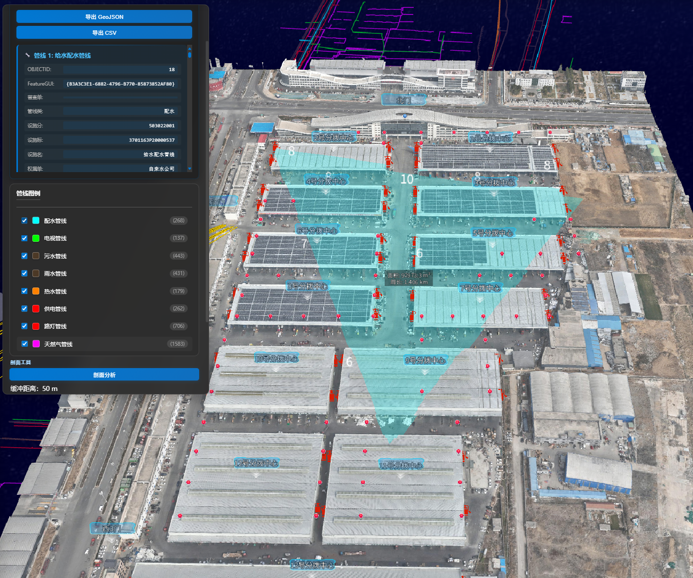
- 图0-3：楼层抽屉展开前后
  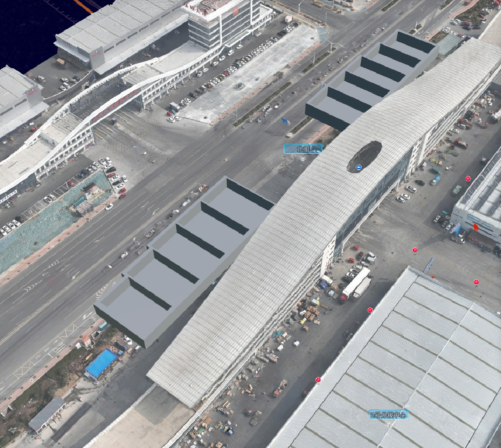
- 图0-4：设施与灭火器标注
  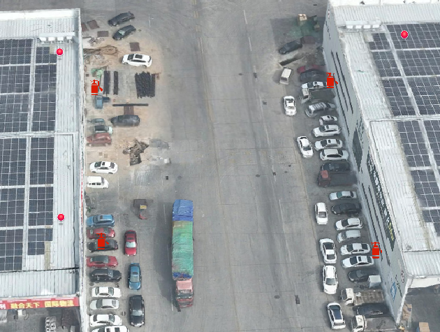
- 图0-5：全景红点聚合与打开
  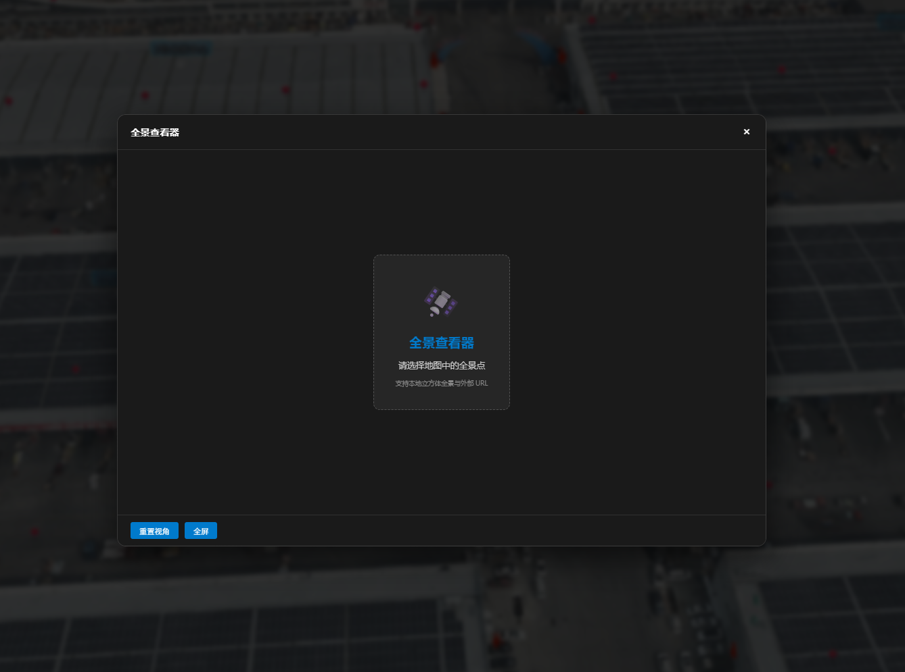
- 图0-6：商家推荐悬浮窗
  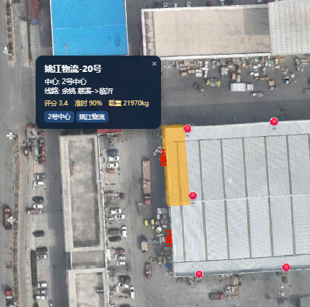
- 图0-7：园区→目的地曲线
  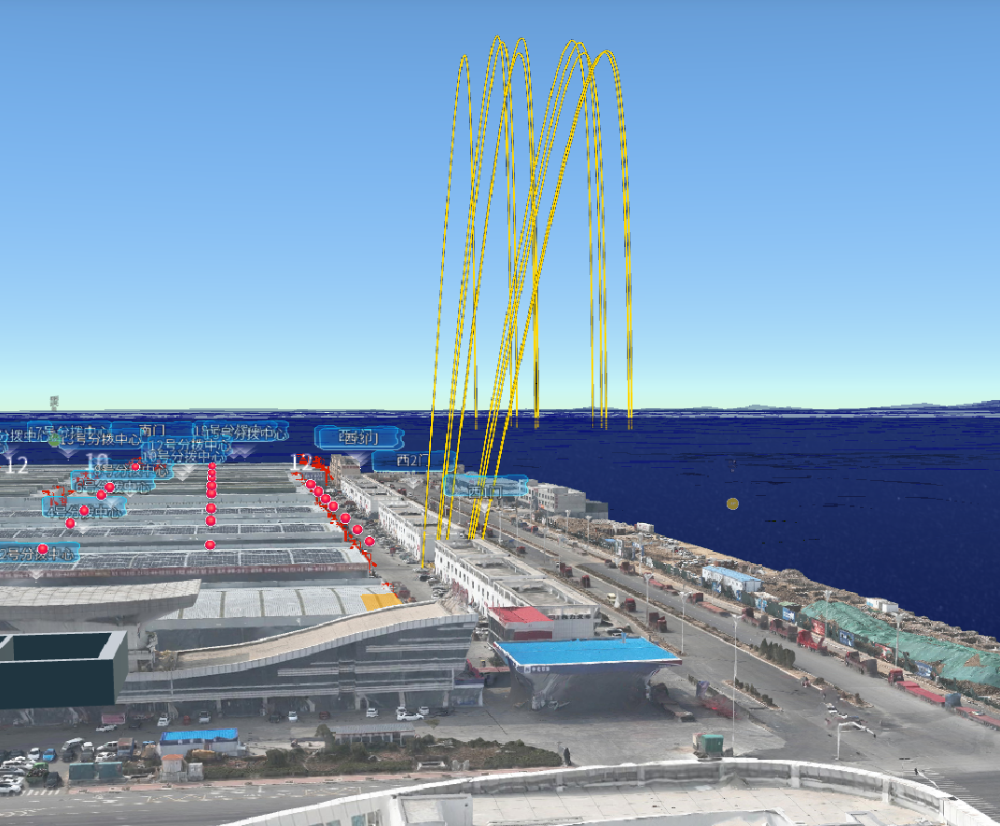

---

## 4. 场景一：天气分析与路线避险（由主页“商家推荐侧栏”进入）

演示步骤：
1) 从首页 `/` 的“商家推荐侧栏”点击“天气分析”入口进入（或自动跳转至 `/weather`）。
2) 切换图层（温度/风力等），观察省份色彩变化与图例。
3) 点击任意点位或省份，查看 Tooltip 详情（温度/风/降水等）。
4) 选择示例路线（如：北京 → 上海），执行一次“路线天气分析/避险推荐”。

预期结果：
- 省份按风险等级着色（低/中/高/极端）。
- Tooltip 显示该点位关键信息。
- 路线评分受恶劣天气影响，给出改道/延后建议。

截图：
- 图1：天气总览 + 风险着色
  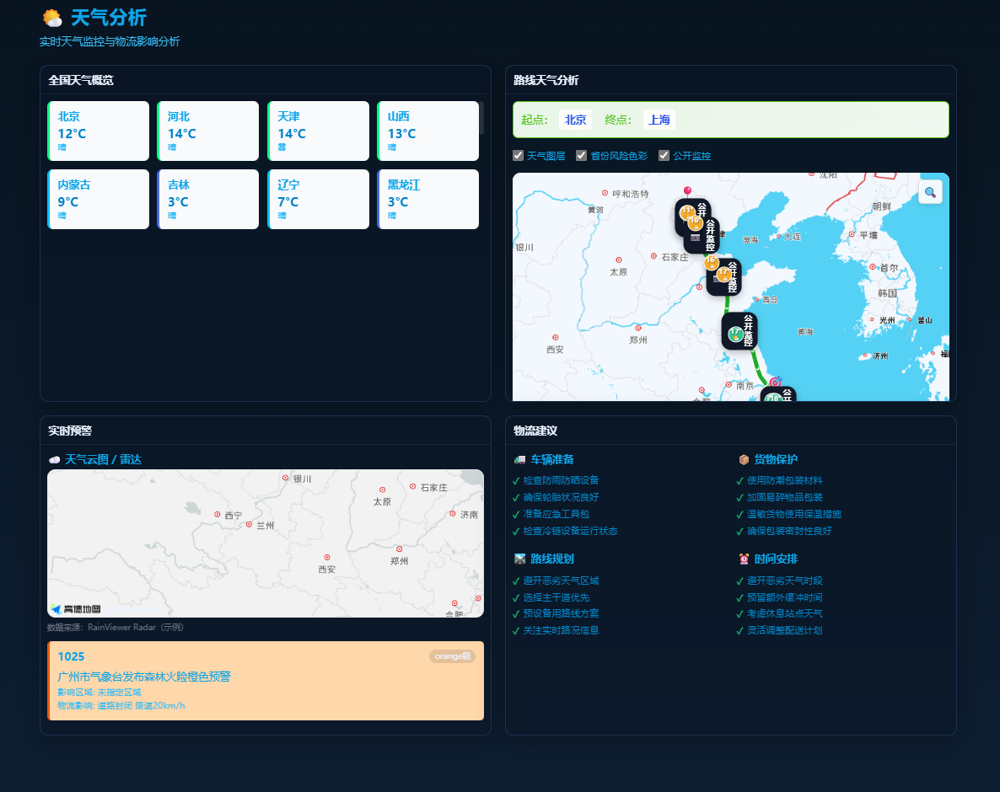
- 图2：Tooltip 与路线避险示例
  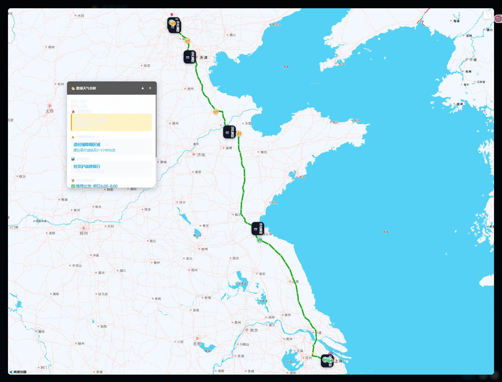

补充说明：
- 环境变量需包含 `VITE_QWEATHER_KEY`、`VITE_AMAP_KEY`、`VITE_AMAP_SECURITY`。
- 风险评估要素与算法参考 `docs/modules/weather.md`。

---

## 5. 场景二：语音助手（跳转/全屏/图层控制）

演示步骤：
1) 在主应用中打开右下角语音助手浮窗，点击“开始识别”。
2) 依次下达口令并观察联动：
   - “打开天气页面” → 自动跳转 `/weather`
   - “全屏”“退出全屏” → 地图全屏切换
   - “显示天气图层”“隐藏天气图层” → 图层开关
3) 若识别存在问题，打开 `tests/pages/voice-debug.html` 查看实时日志。

预期结果：
- 识别最终文本正确显示；页面按口令即时联动。
- 可结合聊天助手，实现“语音 → 文本 → Chat 回复 → TTS 播报”。

截图：
- 图3：语音助手浮窗 + 示例口令
  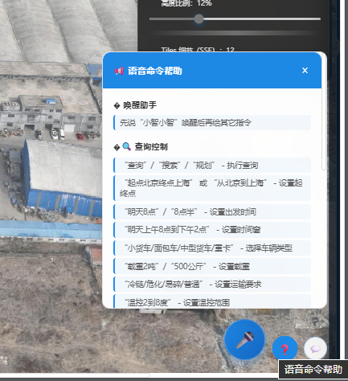

补充说明：
- 语音模块文件与事件总线参考 `docs/modules/voice.md`。
- 在 HTTPS 或“本地安全上下文”下体验更佳；允许麦克风权限。

---

## 6. 场景三：聊天助手（LKE 主流程；Appflow 备验证）

A) LKE 主流程（集成于浮窗聊天）：
1) 在浮窗中打开“AI 助手”，首次会自动初始化。
2) 输入或通过语音识别的文本发送消息，观察流式回复与 TTS 播报（如开启）。
3) 说明与页面的联动能力（如按回复内容切换页面/图层）。

B) Appflow 备选验证（独立测试页）：
1) 打开 `/tests/pages/appflow-test-standalone.html`。
2) 填入 `integrateId` 与 `requestDomain`，依次点击“初始化/显示/发送消息”。
3) 观察右侧日志面板、状态与错误定位（`window.appflowChatDebug.getDebugInfo()`）。

预期结果：
- LKE：可用 WS/SSE，聊天稳定；消息往返无明显阻塞。
- Appflow：SDK 初始化成功，允许显隐与发消息；失败时给出明确错误与调试信息。

截图：
- 图4：Appflow 独立测试页（配置区 + 日志区）
  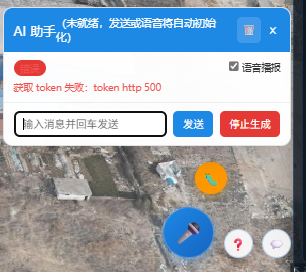

补充说明：
- LKE 变量：`VITE_LKE_APP_KEY`、`VITE_LKE_BOT_ID`、`VITE_LKE_ACCESS_TYPE`、`VITE_LKE_TOKEN_ENDPOINT` 等。
- Appflow 变量：`VITE_APPFLOW_INTEGRATE_ID`、`VITE_APPFLOW_REQUEST_DOMAIN` 等。
- 详见：`docs/OPERATION_GUIDE.zh-CN.md`、`docs/modules/appflow-chat.md`。

---

## 7. 场景四：视频识别（/video-recognition）

演示步骤：
1) 打开 `/video-recognition`，选择内置或本地视频文件。
2) 点击“开始”，观察初始化、预热与推理状态变更。
3) 展示检测框、置信度曲线与统计面板；可调整 `maxFPS` 与阈值。

预期结果：
- 在普通办公机上保持 6–12 FPS 的流畅可视化（取决于分辨率与模型）。
- 若 GPU 受限自动回退 CPU；再不满足则进入 Mock，保障 UI 演示。

截图：
- 图5：视频识别页面（检测框 + 曲线 + 参数面板）
  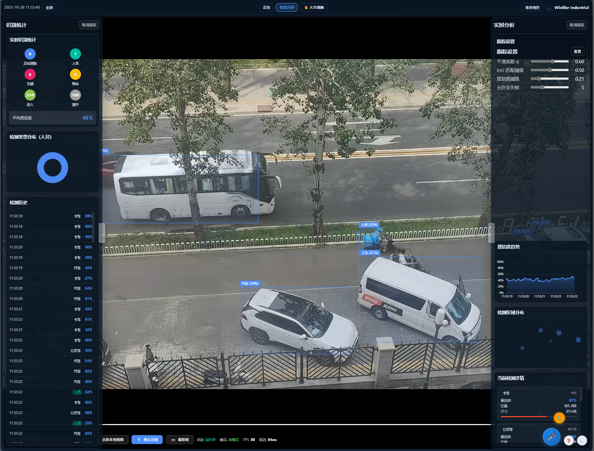

补充说明：
- 优先使用 MediaPipe Tasks；如需 ONNX/ORT 方案参见 `public/onnxruntime-web/` 与 `public/models/`。
- 详细文档：`docs/modules/video-recognition.md`（如存在）。


---

## 8. 场景五：火灾疏散模拟（/fire-evacuation）

演示步骤：
1) 打开 `/fire-evacuation` 页面，看到“火灾疏散模拟视频”卡片网格。
2) 点击“人员疏散/车辆疏散/人车混流”其中一个卡片，展开播放器。
3) 在播放器下方“视角”处切换不同视角（如：默认视角/北门视角），观察保持时间进度的无缝切换。
4) 使用自定义控件进行“播放/暂停”“静音/取消静音”，感受加载指示器状态变化。

预期结果：
- 网格卡片包含标题、简介、时长类别与图标，点击后进入播放视图。
- 播放器具备加载指示、简易播放/静音控件、视角切换（保留当前进度比例）。
- 右上角“关闭”可收起播放器返回网格列表。

截图占位：
- 图7-1：疏散视频网格
  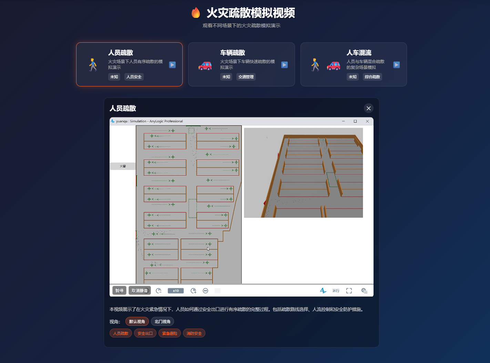
- 图7-2：人员疏散播放中
  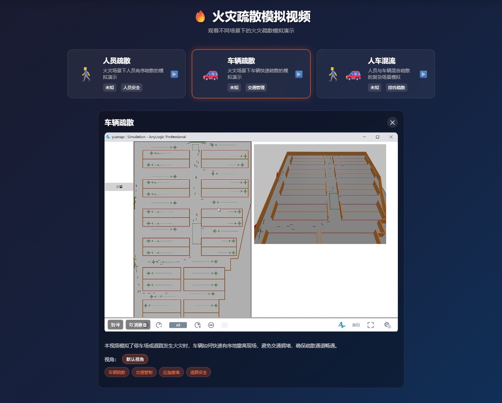
- 图7-3：视角切换
  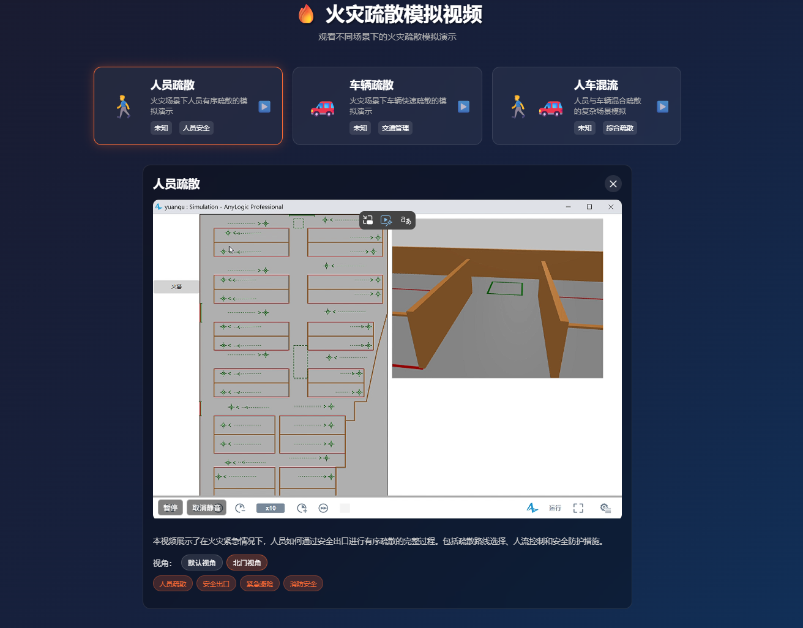

补充说明：
- 源文件位于 `public/FireEvacuation/`（如：人员疏散.mp4、北门视角等），页面代码 `src/views/FireEvacuation.vue`。
- 顶部导航 TopBar 已提供“火灾疏散”入口按钮，或直接访问路由 `/fire-evacuation`。

---

## 10. 独立测试页（便于定位与录制）

| 页面/路径 | 作用 | 推荐录屏镜头 |
|-----------|------|--------------|
| `/tests/pages/appflow-test-standalone.html` | Appflow SDK 最小验证 | 初始化 → 显示窗口 → 发送消息 → 日志 |
| `/tests/pages/appflow-test.html` | Appflow 在项目态方法/事件 | 显隐/发送/事件回调 |
| `/tests/pages/voice-ai-integration.html` | 语音 + Chat 联动 | 语音文本 → Chat 回复 → TTS 播报 |
| `/tests/pages/voice-debug.html` | 语音识别调试 | 启动/停止 → 口令多样性 → 实时日志 |
| `/tests/pages/test-tts.html` | TTS 参数与发音 | 文本/语速/音调调整对比 |

> 若生产环境也需展示这些测试页，请在部署流程中将文件拷贝至静态目录或 Nginx 规则放行。

---

## 12. 常见问题（FAQ）

- 语音识别无响应？
  - 请在 HTTPS 或本地安全上下文访问，并允许麦克风权限；可用 `voice-debug.html` 检查。
- Appflow 初始化失败/400？
  - 检查 `integrateId`、请求域白名单与发布状态；查看独立页右侧日志；运行 `window.appflowChatDebug.getDebugInfo()`。
- 视频识别帧率低？
  - 降低视频分辨率、调小 `maxFPS` 或使用更高配置机器；必要时使用 Mock 演示逻辑。
- 高德地图未定义/插件不可用？
  - 参考动态加载封装与插件按需加载；确认 `VITE_AMAP_KEY`、`VITE_AMAP_SECURITY` 配置。

---

## 13. 参考与延伸阅读

- 《操作手册（zh-CN）》：`docs/OPERATION_GUIDE.zh-CN.md`
- 模块文档索引：`docs/README.md`
- 天气模块：`docs/modules/weather.md`
- 语音模块：`docs/modules/voice.md`
- 高德地图修复：`docs/modules/map-amap-fix.md`、`AMAP_API_FIX.md`

