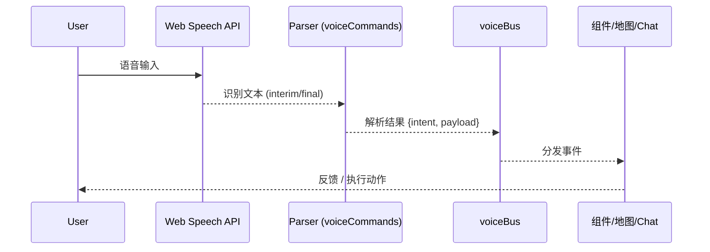

<!-- _paginate: skip -->
# 工业园区智能可视化与 AI 平台
## 地图 · 天气 · 语音 · Chat · 视频识别

作者：<填写> ｜ 日期：2025-10-08

> 面向园区监控与调度决策的多模态智能可视化前端平台。

---
## 目录
1. 项目概述 & 价值
2. 技术栈与总体架构
3. 功能总览
4. 地图 & 动态加载修复
5. 天气服务与推荐增强
6. 3D 天气可视化
7. 语音助手
8. Appflow Chat 集成与降级
9. 视频识别 (YOLOv8 + ORT)
10. 环境变量与安全
11. 性能与工程优化
12. 演示脚本 & FAQ
13. 扩展路线 & 价值总结

---
## 1. 项目概述
定位：集 3D 可视化、天气风险、智能推荐、语音 & Chat 交互、浏览器端 AI 推理于一体。

核心关键词：实时 · 多模态 · 可扩展 · 降级健壮。

业务场景：园区物流路径规划、风险规避、监控辅助决策。

---
## 2. 核心技术栈
- 前端框架：Vue 3 + TypeScript + Vite
- 可视化：Cesium 3D + 高德地图 API
- AI 推理：ONNX Runtime Web + YOLOv8n（浏览器实时）
- 多模态：Web Speech API (ASR+TTS) + Appflow Chat
- 工程与性能：Web Worker / 动态脚本加载 / 缓存策略 / 降级机制

---
## 3. 系统架构（概览 Mermaid）
（示意：模块与数据流。可在导出前根据实际部署细化。）

```mermaid
flowchart LR
  subgraph UI[前端 UI 层]
    A[Vue 组件\nMapView / Weather / Video / Recommend / VoiceFloat / ChatPanel]
  end
  subgraph Composables[业务 Composables]
    B[useVoiceAssistant]
    C[useAppflowChat]
    D[weatherService]
    E[disasterService]
    F[enhancedRecommendScore]
  end
  subgraph Worker[Web Worker]
    W[yoloWorker.ts\n(预处理+推理)]
  end
  subgraph External[外部 / 后端]
    AMAP[高德地图 API]
    QW[和风天气 API]
    CHAT[Appflow Chat SaaS]
    TOKEN[lke-token-server.mjs\n(临时 Token)]
  end
  A <--> B
  A <--> C
  A <--> D
  A <--> F
  D <--> E
  A -->|推理请求/帧| W -->|检测结果| A
  D -->|天气/预警| F
  B -->|命令事件| A
  C -->|消息/状态| A
  F -->|推荐结果| A
  D --> QW
  A --> AMAP
  C --> CHAT
  C --> TOKEN --> CHAT
```

---
## 4. 系统架构（ASCII 备用稿）
```
┌─────────────────────────── UI (Vue Components) ─────────────────────────┐
│ MapView | WeatherAnalysis | VideoRecognition | Recommend | VoiceFloat │
└───────────────────────────────────┬────────────────────────────────────┘
                                    │ 事件/数据绑定
                     ┌──────────────┴──────────────┐
                     │        Composables          │
                     │ useVoiceAssistant / useAppflowChat          │
                     │ weatherService / disasterService            │
                     │ enhancedRecommendScore                      │
                     └──────────────┬──────────────┘
                                    │ 风险/天气/命令/推荐
                         ┌──────────┴──────────┐
                         │    Web Worker       │
                         │   yoloWorker.ts     │ ← 帧数据 / 推理结果 → UI
                         └──────────┬──────────┘
                                    │ 外部调用
         ┌───────────────┬──────────┴──────────┬──────────────┐
         │               │                     │              │
   高德地图 API   和风天气 API        Appflow Chat SaaS   Token 服务
```

---
## 5. 功能总览
- 3D 地图 & 路线展示（动态加载修复）
- 天气监测 + 预警 + 路线风险评估
- 天气增强智能推荐（风险标签 / 动态权重）
- 语音指令（导航 / 图层 / 查询 / 全屏）
- Appflow Chat AI（调试 & 降级能力）
- 视频识别（检测框 / 统计 / 模式切换）
- 独立测试页矩阵（Chat / Voice / 联动 / Mock）

---
## 6. 地图动态加载修复
问题：弱网或懒加载 → window.AMap 未定义。
措施：ensureAMapLoaded 幂等 + 安全码注入 + 错误提示 + 重试入口。
收益：初始化稳定性↑ / 首屏失败率↓ / 易维护。
后续：加载状态指示、缓存脚本、失败自动重试策略。

---
## 7. 天气服务集成价值
目标：让推荐“感知天气风险”→ 更安全 / 更稳妥。
要素：温度 / 降水 / 风速 / 能见度 / 灾害预警。
结果：路线筛选 + 风险等级标签 + 货品品类差异化策略。
演示：/weather 与 /weather-test 联动。

---
## 8. 天气数据与缓存策略
- 分层缓存：实时点(15m) / 省份概览(60m) / 风险评估(30m)
- 降级：请求失败 → 使用上次成功数据
- 可扩展：多源数据融合 / IndexedDB 持久化
数据流：API → 归一化 → 缓存 → 推荐 & 可视化。

---
## 9. 智能推荐（天气增强）
示例：score_final = baseScore * (1 - weatherPenalty) + safetyBonus
维度：风险等级 / 优先级权重 / 冷链温度范围匹配
风险级别：low / medium / high / extreme
兼容：不启用天气时保持原算法输出。

---
## 10. 3D 天气可视化 (Cesium)
- 温度点位 / 预警标记 / 可切换图层
- 自定义 DataSource 管理实体
- 交互：点击点位 → Tooltip 详情
- 优化：批次添加 / 图标缓存 / 条件渲染

---
## 11. 语音助手
模块：useVoiceAssistant + voiceCommands + voiceBus + UI 浮窗。
命令：导航 / 图层 / 天气 / 全屏 / 查询 / 关闭。
事件：onVoiceCommand(e) → { raw, isFinal, parsed.intent }
扩展：LLM 语义增强、多语言、指令冲突去重。

---
## 12. 语音指令事件流（Mermaid）


---
## 13. Appflow Chat 集成
特点：生命周期管理 / 超时降级 / 调试对象 / 消息队列。
调试：window.appflowChatDebug.getDebugInfo()
降级：初始化失败 → fallback UI + 重试按钮。
测试页：/appflow-test /appflow-test-standalone /voice-ai-integration。

---
## 14. Chat 常见问题速查表
| 症状 | 排查 |
|------|------|
| 400 | integrateId / 域名白名单 / 发布状态 |
| CORS | 请求域名未加入白名单 |
| ReadableStream 锁 | 400 连带，先解决 400 根因 |
| 无法展示 | show/open 版本差异，使用包装方法 |
| 初始化卡死 | 超时后触发 reset + fallback |

---
## 15. 视频识别模块
管线：<video> 帧 → Worker → ORT session.run → NMS → Overlay 绘制。
功能：检测框 / 类别统计 / 置信度曲线 / Mock 模式切换。
参数：confidence=0.25 / iou=0.45 / maxFPS=8 / mockMode。
扩展：轨迹跟踪 / 行为识别 / 对象缓存池。

---
## 16. 推理流程（Mermaid）
```mermaid
flowchart LR
  V[Video Frame] --> P[预处理\nresize/normalize]
  P --> W[Web Worker]
  W --> ORT[ONNX Runtime Web\n(session.run)]
  ORT --> NMS[后处理\nNMS过滤]
  NMS --> O[主线程绘制\nCanvas Overlay]
  O --> STATS[统计面板\n类别/趋势]
```

---
## 17. 环境变量与安全
公开 (VITE_*): 构建期注入（视为可见）
私密 (SECRET_*): 仅后端 / Token 服务
文件：.env.example / .env.local(忽略)
策略：Key 绑定来源域名 + Token 临时签发 + gitleaks (可选)
不要：将长期密钥写死进前端。

---
## 18. 性能与工程优化
手段：
- 动态脚本/模型懒加载
- Web Worker 隔离推理
- 缓存层 (天气 / 预警)
- 初始化幂等与超时降级
- 抽帧与 FPS 限制
潜在：埋点采集 / IndexedDB 预取 / 资源预热。

---
## 19. 性能对比示例 (说明用)
> 说明：以下数值为示例占位，正式材料请用真实测量替换。

### 推理性能（示例）
| 模式 | 平均帧率 (FPS) | 主线程阻塞(ms) | 首帧时间(ms) |
|------|----------------|----------------|--------------|
| 无 Worker (直跑) | 3 | 120 | 1800 |
| Worker + 限 FPS | 7–8 | 25 | 1550 |
| Worker + 预加载模型 | 7–8 | 25 | 1100 |

### 地图加载（示例）
| 优化前 | 优化后(动态加载+幂等) |
|--------|-----------------------|
| 首次失败率 ~8% | <1% |
| 重新加载需刷新 | 支持重试按钮 |

> 可补充实际监控：TTFB / LCP / 推理耗时 / 命令响应延迟。

---
## 20. 演示脚本建议
1) 天气风险：/weather 展示风险标签 + 推荐差异
2) 语音指令：打开图层 → 切换页面 → 全屏
3) Chat：正常初始化 + 模拟降级
4) 视频识别：Mock → 实时模式 → 置信度调节
提示：预热模型 / 检查麦克风 / 准备 API Key。

---
## 21. 常见问题（FAQ）
- 语音无响应：需 HTTPS & 麦克风权限
- Chat 400：integrateId / 域名白名单
- 模型加载失败：资源路径 & MIME & 浏览器版本
- 高德未定义：动态加载失败或 Key 缺失
- 推理卡顿：降低 video 分辨率 & 限 FPS

---
## 22. 扩展路线
短期：轨迹跟踪 / 多语言语音 / 历史天气曲线 / Chat 日志埋点
中期：多源天气融合 / IoT 实时传感器 / 行为识别
长期：AI 路径预测模型 / 边缘协同（端+云） / 移动端适配 / 大屏驾驶舱。

---
## 23. 运维与监控
- API 配额与错误率监控
- 前端错误上报（建议接入 Sentry）
- Token 服务速率限制 / 审计日志
- 资源预热：模型 & 地图脚本
- 发布分层：dev / staging / prod

---
## 24. 价值总结
业务：风险前置、决策提效、统一演示底座。
技术：多模态融合 / 浏览器侧推理 / 降级与健壮性 / 高可扩展架构。
战略：可复制扩展到园区安全、资产巡检、智慧调度等垂直场景。

---
## 25. Q & A
谢谢！

> 联系方式 / 仓库链接 / 下一步行动计划。

---
## 附录：替换真实性能数据指引
1. 使用 Performance API 记录模型首帧（模型 session init 完成 → 第一次检测输出）。
2. 用 requestAnimationFrame 包裹逻辑统计平均帧率。
3. 主线程阻塞：PerformanceObserver 采集 long tasks (>50ms)。
4. 语音响应：ASR onresult final → UI 更新 时间差。
5. 推荐：记录发起查询 → 结果渲染差值。

---
## 附录：真实数据表（占位）
| 指标 | 采集方法 | 占位值 | 备注 |
|------|----------|--------|------|
| 模型首帧(ms) | performance.now | 1100 | 需真实替换 |
| 平均 FPS | 帧计数 | 7.5 | Worker 限 8fps |
| 语音指令响应(ms) | 事件差值 | 320 | 语音->动作 |
| 推荐返回(ms) | Promise 计时 | 210 | 缓存命中 |
| 地图初始化失败率 | 统计加载错误 | <1% | 幂等加载 |

---
## 附录：替换步骤清单
1. 本地开启性能日志开关（待实现可选）。
2. 导出 JSON (metrics.json)。
3. 脚本生成表格（可写 npm 脚本）。
4. 将真实数值覆盖“示例”页。

---
## 结束
（备用空页，可按需要增删）
